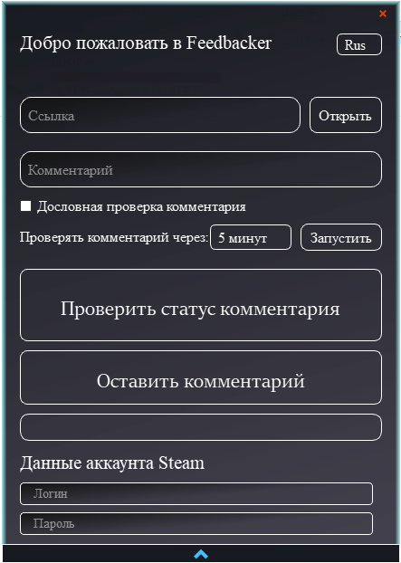

# Project - Steam-comment-bot

### Цель:

Создание приложения для автоматического написания комментариев в профилях Steam.

### Target:

Creating an application to automatically write comments on Steam profiles.

### Технологический стек / Technology stack:

- Python 3.11+
- PyQt5 5.15.9+
- Bs4 0.0.1+
- Selenium 4.8+

### Интерфейс / Interface:

### Основной функционал:

- Проверка наличия указанного комментария на указанной странице и вывод информации о ее результате и времени проверки.
- Запуск автоматической проверки наличия комментария на странице через заданный промежуток времени. Автоматическое
  написание комментария при его отсутствии.

Операция написания комментария осуществляется через существующий аккаунт Steam, данные от которого необходимо указывать
в поле ("Данные аккаунта Steam"/"Data of Steam account").

Для проверки наличия комментария, данные от инициирующего аккаунта не нужны.

Политика [Steam](https://store.steampowered.com/privacy_agreement/) накладывает определенные ограничения на аккаунты, поэтому не со всех аккаунтов возможно оставить комментарий.

Для полноценной работы программы в автоматическом режиме рекомендуется отключать двухэтапную аутентификацию.
В противном случае необходимо подтверждать вход в аккаунт каждый раз при написании нового комментария.

### Main functionality:

- Checking the presence of the specified comment on the specified page and displaying information about its result and the time of the check.
- Launch automatic check for the presence of a comment on the page after a specified period of time. Automatic writing a comment in its absence.

The operation of writing a comment is carried out through an existing Steam account, the data from which must be specified in the field ("Steam account data"/"Data of Steam account").

To check for the presence of a comment, data from the initiating account is not needed.

The [Steam](https://store.steampowered.com/privacy_agreement/) policy imposes certain restrictions on accounts, so not all accounts can leave a comment.

For full-fledged operation of the program in automatic mode, it is recommended to disable two-step authentication.
Otherwise, you must confirm the login to your account every time write a new comment.